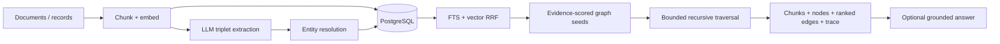

# Architecture

## Decision and product boundary

Postgres Graph RAG is an evidence-retrieval layer for teams that already run
PostgreSQL and need moderate-scale, multi-hop knowledge retrieval without a
second graph or vector database. It does not claim to replace a graph-native
database for arbitrary graph analytics.

The secure tenant API is the primary product. The namespace-only engine is a
compatibility layer.

## Ingestion

1. A document is identified by tenant, namespace, and `source_id`.
2. Chunks and embeddings are persisted before extraction so provider failures
   remain searchable and retryable.
3. A lease keyed by tenant, content hash, provider, model, and prompt version
   prevents duplicate paid extraction.
4. Exact normalization, trigram similarity, and embedding confirmation resolve
   human-readable entities. Digit-bearing/versioned identifiers require exact
   normalized equality to prevent cross-incident graph shortcuts.
5. Entity and edge mentions connect facts to the exact supporting chunk.

## Retrieval

`vector` searches chunk embeddings. `hybrid` fuses PostgreSQL full-text and
vector ranks with reciprocal-rank fusion. `hybrid_graph` maps the best evidence
chunk to its mentioned entities, preferring a retrieved chunk containing exact
query identifiers, propagates its relevance, then expands a bounded graph.
Limiting roots avoids turning unrelated top-k candidates into equally strong
graph seeds. Nodes and edges are deterministically ranked before a token budget
is applied. The exact chunks that asserted retained graph edges are batch-loaded
into the evidence set, so multi-hop answers can cite source documents rather
than citing an inferred node label.

`RetrievalTrace` exposes stage latency, candidate counts, normalized seed
scores, context size, and truncation. `answer()` is optional and rejects model
citations that do not correspond to retrieved chunks.

## Valuable complexity

- RLS, provenance, extraction leases, and lifecycle-safe deletion protect real
  production properties.
- Recursive traversal and path evidence make multi-hop results inspectable.
- Community detection is deliberately outside the request path; its current
  per-node iteration is not a scale advantage.

## Known limits

- Recursive CTE traversal is intended for bounded, moderate graphs.
- Entity resolution needs domain-specific evaluation before aggressive fuzzy
  thresholds are trusted.
- Changing embedding dimension requires re-embedding into a compatible schema.
- The library returns evidence and an optional answer; it is not an autonomous
  investigation agent.
