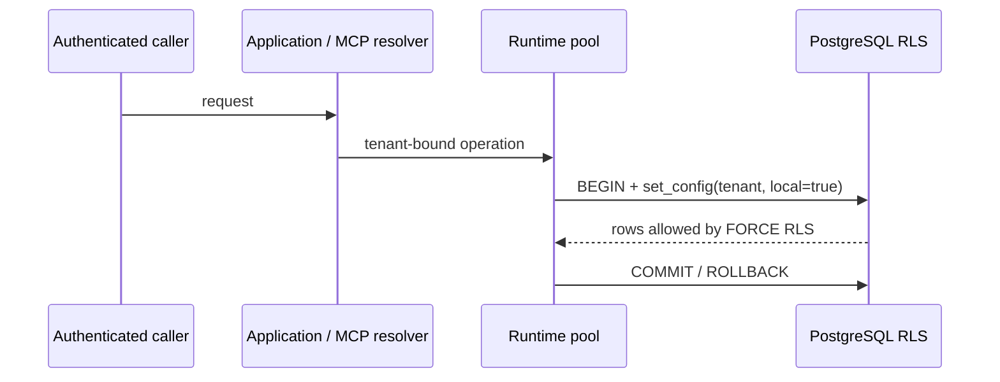

# Security Model

## Trust boundaries

- The admin DSN may create extensions, schemas, policies, and roles. It is used
  only for migration.
- The runtime DSN belongs to a `NOSUPERUSER NOBYPASSRLS` role and remains on a
  trusted server.
- End users never receive either database credential.
- Tenant identity is resolved by trusted application authentication before a
  `TenantGraphRAG` instance is created.

Every domain table compares `tenant_id` with a transaction-local GUC. Missing
context evaluates to no rows. Pool reuse cannot retain the setting after the
transaction ends.

## MCP

Stdio binds one tenant to one process. HTTP requires a tenant resolver unless
explicit unauthenticated development mode is used on loopback. Mutations remain
opt-in. The project does not implement OAuth issuance or client registration.

## Secret response

If a key appears in chat, logs, Git, or a screenshot: revoke it, create a new
restricted project key, review usage, and update only the local secret store.
Never test or reuse the exposed value. CI runs without provider credentials.
